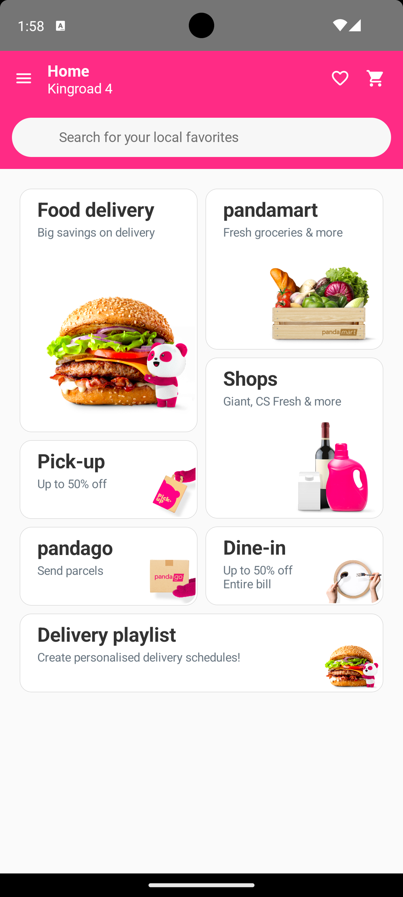
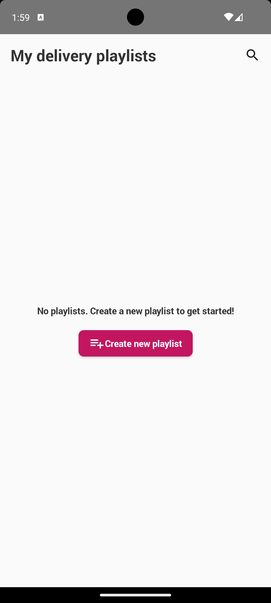
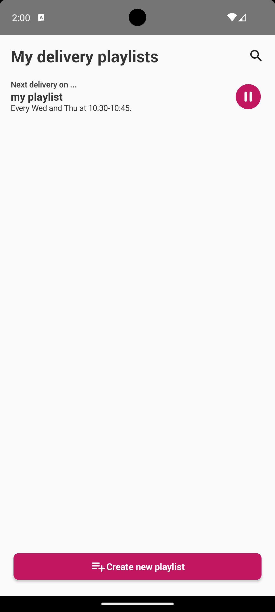
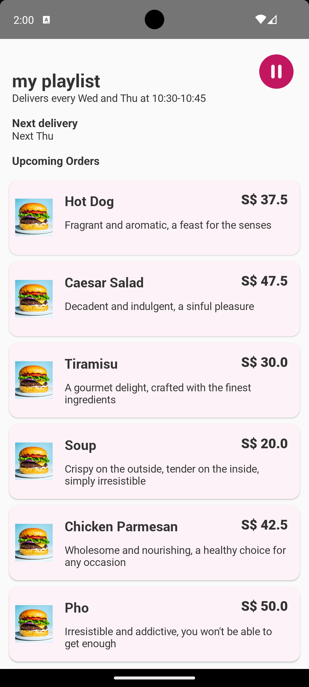
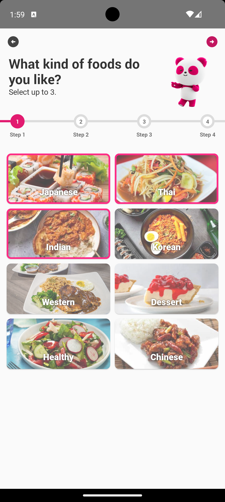
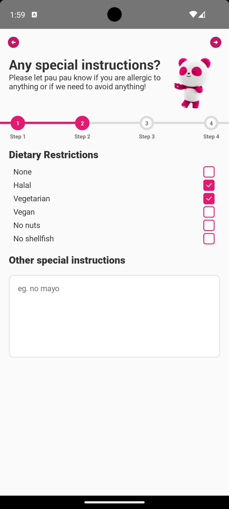
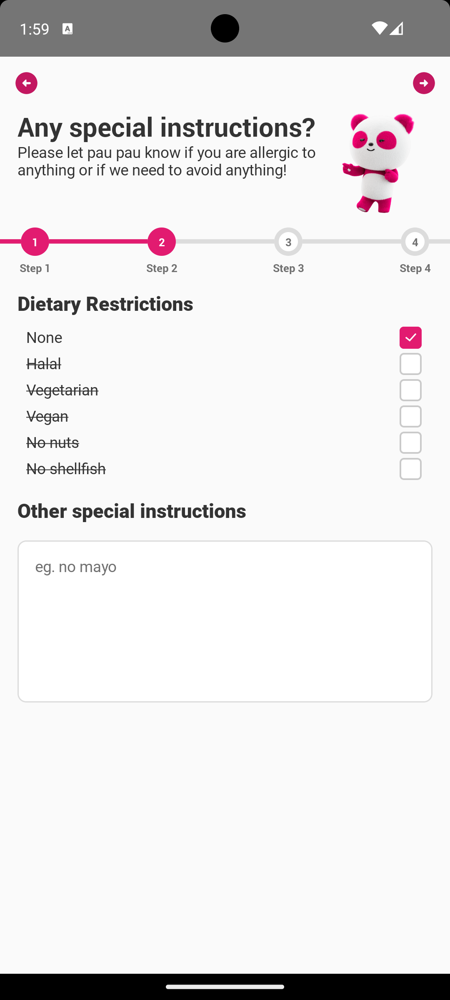
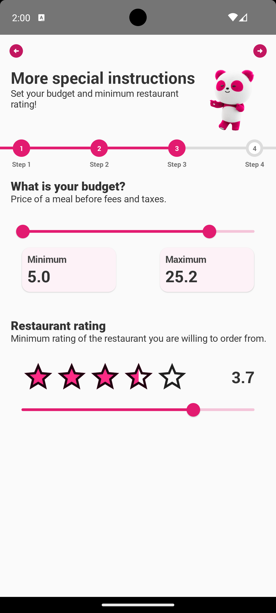
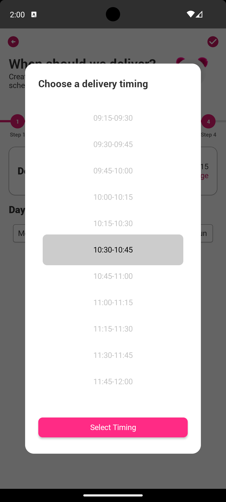
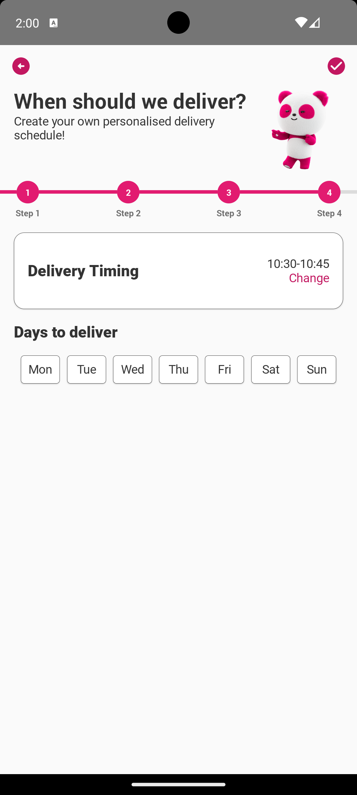

# Food Delivery Playlist — PowerUp SG Capstone Project

A capstone project for **PowerUp SG**, focused on a **Food Delivery Playlist** experience (foodpanda capstone).

---

## Overview

This project introduces a food delivery playlist concept developed as part of the PowerUp SG capstone. It aims to solve the common problem of not knowing what food to order by allowing users to input their food preferences and preferred delivery times for regular meals. Based on these inputs, the system generates a curated “playlist” of recommended restaurants and dishes for users to order from.

---

## Main features

- **Home** — foodpanda-style home with search and tiles for Food delivery, Pick-up, pandamart, Shops, Dine-in, and **Delivery playlist** (entry point to your playlists).
- **Playlist library** — View all delivery playlists, see schedule (days and time), play or pause a playlist, and create a new playlist.
- **Preference flow** — Multi-step setup: choose cuisines (up to 3), add special instructions or allergies, set budget and minimum restaurant rating, then choose delivery days and time. Name your playlist to create it.
- **Playlist detail** — See a playlist’s upcoming orders and the list of recommended restaurant items for that playlist.

---

## Screenshots

### Home

### Playlists

### Preferences (create playlist)

---
